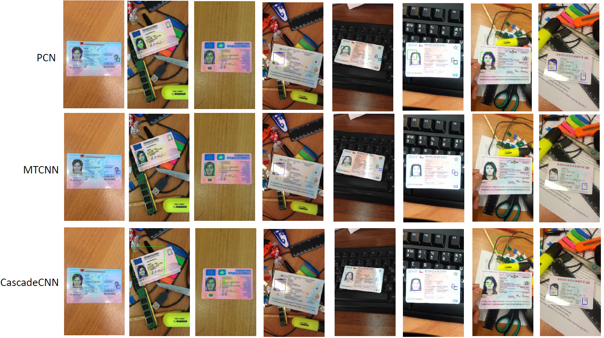
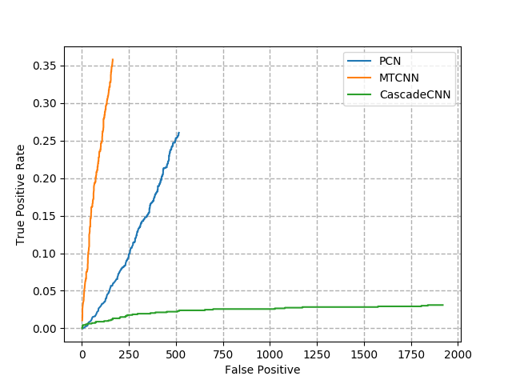

# Face_detection_of_ID_card (Python2.7, tensorflow1.6)
This is the implementation of the paper ["Face Detection in Camera Captured Images of Identity Documents under Challenging Conditions,”](https://arxiv.org/pdf/1911.03567.pdf) in the ICDAR 2019 workshop CBDAR 2019; The evaluation of the stat-of-art face detection algorithm with the ROC and PR as WIDER FACE and FDDB on the latest challenge dataset [MIDV-500](https://arxiv.org/ftp/arxiv/papers/1807/1807.05786.pdf).
# Evaluations of the face detection algorithms on MIDV-500
- [MTCNN](https://kpzhang93.github.io/MTCNN_face_detection_alignment/paper/spl.pdf);
- [Cascade-RCNN](https://arxiv.org/pdf/1712.00726.pdf) 
- [Progressive Calibration Networks (PCN)](https://arxiv.org/pdf/1804.06039.pdf)

### Citation
      @inproceedings{bakkali2019face,
        title={Face Detection in Camera Captured Images of Identity Documents under Challenging Conditions},
        author={Bakkali, Souhail and Luqman, Muhammad Muzzamil and Ming, Zuheng and Burie, Jean-Christophe},
        booktitle={2019 International Conference on Document Analysis and Recognition Workshops (ICDARW)},
        volume={4},
        pages={55--60},
        year={2019},
        organization={IEEE}
      }
      
 ### License
This code is distributed under MIT LICENSE

### Contact
zuheng.ming@univ-lr.fr
